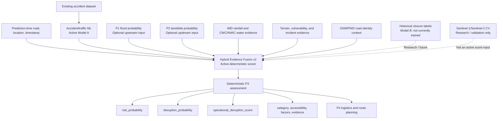

# P3 — Road Risk and Disruption Intelligence

P3 is the road-risk service in NER-Smart-Logistics. It combines the existing
accident/traffic risk model with available flood, landslide, environmental,
terrain, road-vulnerability, and incident evidence.

P3 does **not** predict or certify an official road closure. Its current
`disruption_probability` is a deterministic **evidence-fusion road disruption
likelihood estimate**, not a statistically calibrated supervised probability.
The result is intended to support logistics dispatch, route comparison, and P4
operational planning.

## 1. Purpose

P3 accepts a road, location, timestamp, optional P1/P2 hazard probabilities,
and prediction-time evidence. It returns:

- `risk_probability`: accident/traffic severity risk from the active P3 model.
- `disruption_probability`: the deterministic hybrid v2 disruption estimate.
- `operational_disruption_score`: the same final disruption score for downstream routing.
- `accessibility_score`: `100 * (1 - operational_disruption_score)`.
- `disruption_category`, evidence completeness, factors, evidence flags, and explanation metadata.

`risk_probability` describes accident/traffic risk. `operational_disruption_score`
describes broader operational difficulty. Accessibility is a bounded routing
proxy; it is not a separately trained accessibility model.

## 2. Architecture



The deterministic hybrid engine is the only numerical authority. Model B and
satellite/CV work are not active dependencies of the production disruption
score.

## 3. Datasets Used

| Dataset | Source and repository location | Purpose and status |
|---|---|---|
| Indian road accident dataset | Public archive retained at `data/raw/training/indian_road_accident/indian_road_accident.zip` | Training and evaluation for Model A accident-severity risk. The archive contains 20,000 records from India. |
| IoT traffic dataset | `data/raw/training/iot_traffic_dataset/iot.zip` | Audited as a separate traffic source. It is not merged into Indian Model A training because its coverage and coordinates are not compatible. |
| India road network / OSM PBF | `data/raw/roads/india-latest.osm.pbf` when present | Road-geometry and identity research/audit through the conservative local matcher. It is not a closure-label source and is not an accident-model training dataset. |
| IMD rainfall grid | `data/raw/rainfall/IMD_rainfall_*.nc` | Causal rainfall enrichment in the data pipeline, using observations available by the prediction timestamp. It is not a standalone closure model. |
| CWC/NWIC river telemetry | `data/raw/water_levels/cwc_river_levels.csv.csv` | River/station enrichment and context. Local coverage is not consistently contemporaneous with the accident training period. |
| Historical landslide inventory | `data/raw/landslides/historical_landslides.geojson` | Landslide enrichment and road-impact evidence discovery. It is not a supervised P3 closure target. |
| Consolidated road-impact evidence | `data/processed/road_closure/road_closure_events.parquet` and `.csv` | Historical closure evidence audit. Unknown status remains unknown; missing records are never converted to open labels. |
| Uttarakhand PWD road-status sample | `data/raw/training/uttarakhand_pwd/` and `data/processed/road_disruption/pwd_road_status_events.parquet` | Controlled schema, identity, and label-feasibility research. It does not currently provide a reliable road-geometry join for Model B. |
| Sentinel-1/Sentinel-2 experiment | `data/raw/satellite/`, `data/processed/features/p3_satellite_event_features.parquet`, and `data/reports/satellite_*` | Event-centred research and feasibility validation. Satellite/CV is not the source of the final disruption score and no satellite model is trained. |

The accident dataset is the only dataset used to train the active accident/
traffic model. Historical closure evidence currently has insufficient defensible
positive/negative, temporal, and road-identity coverage for Model B. In
particular, missing closure records are not negative labels. P1 and P2
probabilities are accepted as upstream inputs when legitimately available;
P3 does not fabricate them or import their model implementations.

## 4. APIs and External Data Sources

| Source | Data | P3 use | Runtime status |
|---|---|---|---|
| OSM/Geofabrik road data | Road geometry and tags, usually through a local India PBF | Conservative identity and geometry audit; no official closure claim | Offline/research; not required by `/predict` |
| IMD rainfall data | Historical gridded rainfall | Causal rainfall feature enrichment | Offline pipeline input; not required for a request if unavailable |
| CWC/NWIC telemetry | River/station observations | River-level context and enrichment | Offline/local context; availability affects evidence completeness |
| GDELT public API | Public news discovery | Searches for candidate road-impact evidence; not a direct prediction input | Optional research/discovery; no validated live closure label is assumed |
| ASDMA and government report pages | Public reports and PDFs | Evidence discovery and provenance | Research/offline acquisition; not a runtime scoring dependency |
| Uttarakhand PWD MIS | Public road-status pages and segment history | Controlled schema, identity, and label-feasibility audit | Research/optional acquisition; no reliable geometry join established |
| Copernicus Data Space Ecosystem | Sentinel-1/Sentinel-2 catalog and Process APIs | Opt-in satellite feasibility experiment | Optional research; requires `CDSE_CLIENT_ID` and `CDSE_CLIENT_SECRET` |
| P1/P2 provider interfaces | Generic HTTP probability providers in `src/providers/upstream.py` | Accept flood/landslide probabilities without coupling to P1/P2 implementations | Optional; unavailable providers return null |

No traffic or incident API is required by the current P3 `/predict` endpoint.
Incident factors are accepted as request-time evidence. The `/analyze` route
uses the existing local `RiskEngine`; its external-provider comments describe
future integrations, not active API calls.

## 5. Machine Learning Models

### Active Model A: accident/traffic risk

The active artifact is `models/p3_road_risk_v002.joblib`, selected by
`models/current_model.json`. It is a HistGradientBoosting-based classifier
with preprocessing for the following 17 production features:

```text
latitude, longitude, hour, is_weekend, lanes, traffic_signal,
temperature, is_peak_hour, road_type, weather, visibility, traffic_density,
city, state, nearest_landslide_distance_km, nearby_landslide_count,
nearest_river_distance_km
```

It is trained on the Indian road accident dataset with a chronological
14,000/3,000/3,000 train/validation/test split. Its target is
`severity_risk_target`: fatal or major accident severity versus minor severity.
Its output is `risk_probability`, which is accident/traffic severity risk, not
disaster-specific road disruption probability.

Current v002 test metrics from the stored metadata include ROC-AUC `0.518419`,
PR-AUC `0.455175`, F1 `0.462056`, precision `0.450109`, recall `0.474654`, and
Brier score `0.249559`. The model remains unchanged by the hybrid disruption
calculation.

### Model B: physical road disruption

Model B is intended to estimate physical road disruption or closure using
road-level historical events. It is **not trained**. The available evidence has
unknown statuses, insufficient dated open/reopened records, incomplete road
identity/geometry joins, and no defensible temporally aligned binary target.
No closure labels are fabricated, and no supervised Model B accuracy is
claimed.

## 6. Disruption Calculation

The implementation is `src/hybrid.py`; weights are loaded from
`models/hybrid_weight_config.json` (`p3_hybrid_v2`). All factors are validated
in `[0, 1]`. Missing values remain unavailable. Weighted averages renormalize
over available positive-weight factors.

### Flood component

```text
flood_environment = weighted_average(
    rainfall_factor, river_factor,
    flood_vulnerability_factor, nearby_flood_factor
)
flood_disruption = flood_probability * flood_environment
```

The configured environmental weights are rainfall `0.40`, river `0.30`, flood
vulnerability `0.20`, and nearby flood evidence `0.10`. Nearby flood evidence is
included as a small, configurable incident modifier rather than treated as a
second flood probability.

### Landslide component

```text
landslide_environment = weighted_average(
    rainfall_factor, slope_factor,
    terrain_susceptibility_factor, nearby_landslide_factor
)
landslide_disruption = landslide_probability * landslide_environment
```

Weights are rainfall `0.35`, slope `0.35`, terrain susceptibility `0.20`, and
nearby landslide evidence `0.10`.

### Traffic component

```text
traffic_disruption = weighted_average(
    risk_probability, nearby_accident_factor, congestion_factor
)
```

Weights are existing accident/traffic risk `0.60`, nearby accident evidence
`0.30`, and congestion `0.10`. The existing model's `risk_probability` remains
the primary ML traffic signal.

### Top-level fusion and synergy

The top-level hazard weights are flood `0.40`, landslide `0.40`, and traffic
`0.20`. If a complete component is unavailable, these weights are renormalized
across the available components:

```text
raw_disruption = weighted_average(
    flood_disruption, landslide_disruption, traffic_disruption
)

synergy_bonus = 0.10 * clamp(
    (min(flood_probability, landslide_probability) - 0.50) * 2,
    0,
    1
)
```

The synergy bonus is zero when either hazard probability is unavailable. It is
small by design and is capped at `0.10`.

### Road vulnerability and final score

When a valid road vulnerability estimate exists, the configured modifier is:

```text
vulnerability_modifier = 0.90 + 0.20 * road_vulnerability
adjusted_disruption = (raw_disruption + synergy_bonus) * vulnerability_modifier
disruption_probability = clamp(adjusted_disruption, 0, 1)
operational_disruption_score = disruption_probability
```

The current estimate uses explicit `road_vulnerability_factor` when supplied,
or `road_type_vulnerability_factor` as the available proxy. The modifier is
bounded from `0.90` to `1.10`; with no vulnerability evidence it is `1.0`.

### Spatial and temporal relevance

For incident metadata with distance:

```text
spatial_factor = exp(-distance_km / scale_km)
```

The configured spatial scale is 5 km. For incident metadata with an event
timestamp:

```text
temporal_factor = exp(-age_hours / tau_hours)
```

The configured temporal decay constant is 24 hours. Effective incident evidence
is multiplied by the available spatial and temporal factors. A future event
relative to the prediction timestamp is rejected. Missing distance or timestamp
metadata leaves the supplied incident factor unchanged.

### Evidence, categories, and accessibility

`evidence_completeness` is the fraction of 12 expected core factors that are
available. It describes evidence availability, not statistical confidence.
`disruption_confidence` is `LOW` below `0.50`, `MEDIUM` from `0.50` through
below `0.80`, and `HIGH` at or above `0.80`.

Final score categories are:

| Score | Category |
|---:|---|
| `< 0.25` | LOW |
| `0.25` to `< 0.50` | MODERATE |
| `0.50` to `< 0.75` | HIGH |
| `>= 0.75` | CRITICAL |

`accessibility_score` is `100 * (1 - disruption_probability)`. The result is
bounded to 0–100 and is an operational routing proxy.

## 7. Input / Output Contract

The calculation engine accepts the canonical nested structure:

```json
{
  "road_id": "osm_way_123456",
  "timestamp": "2026-09-08T09:30:00+05:30",
  "upstream_predictions": {
    "flood_probability": 0.72,
    "landslide_probability": 0.64
  },
  "traffic_risk": {
    "risk_probability": 0.41,
    "incident_factor": 0.30,
    "congestion_factor": 0.20
  },
  "environment": {
    "rainfall_intensity_factor": 0.80,
    "river_level_factor": 0.65
  },
  "terrain": {
    "slope_factor": 0.75,
    "terrain_susceptibility_factor": 0.70
  },
  "road_vulnerability": {
    "flood_vulnerability_factor": 0.60,
    "road_type_vulnerability_factor": 0.70
  },
  "incidents": {
    "nearby_landslide_factor": 0.50,
    "nearby_flood_factor": 0.30,
    "nearby_accident_factor": 0.40
  }
}
```

The HTTP `/api/v1/road-risk/predict` endpoint accepts the corresponding flat
Pydantic request fields, including road location, timestamp, optional upstream
probabilities, environmental factors, vulnerability factors, incident factors,
distances, and event timestamps.

Important response fields are:

- `risk_probability`: active accident/traffic model output.
- `disruption_probability`: deterministic hybrid v2 likelihood estimate.
- `operational_disruption_score`: identical final score for P4.
- `accessibility_score`: deterministic 0–100 routing proxy.
- `disruption_category`: LOW, MODERATE, HIGH, or CRITICAL.
- `evidence_completeness` and `disruption_confidence`: evidence availability metadata.
- `components`, `factors`, `evidence`, and `score_contributions`: deterministic traceability fields.
- `explanation`: deterministic primary driver, secondary driver, key factors, and missing evidence.

## 8. Pipeline Flow

1. Receive road, location, and prediction timestamp.
2. Read optional upstream flood and landslide probabilities.
3. Obtain or receive existing accident/traffic risk.
4. Read available rainfall and river evidence.
5. Read terrain, vulnerability, and incident evidence.
6. Apply available spatial proximity and temporal decay.
7. Calculate flood disruption.
8. Calculate landslide disruption.
9. Calculate traffic disruption.
10. Renormalize and apply top-level hybrid fusion.
11. Add the bounded hazard synergy bonus.
12. Apply the bounded vulnerability modifier when available.
13. Calculate accessibility and assign the final category.
14. Return deterministic factors, evidence, contributions, and explanation.

## 9. Project Structure

```text
p3-road-risk/
├── src/
│   ├── api.py                         FastAPI routes
│   ├── main.py                        FastAPI application
│   ├── hybrid.py                      Authoritative deterministic v2 engine
│   ├── schemas.py                     HTTP request/response models
│   ├── ml_pipeline/                   Model loading, training, readiness reports
│   ├── data_pipeline/                 Accident/evidence ingestion and normalization
│   ├── data_acquisition/              Closure, PWD, and source-audit workflows
│   ├── providers/                     Generic optional upstream probability adapters
│   └── satellite_cv/                  Geometry, masks, and satellite research tools
├── models/                            Model artifacts and hybrid configuration
├── data/raw/                          Source archives and downloaded inputs
├── data/processed/                    Canonical and enriched tables
├── data/reports/                      Audit, readiness, and feasibility reports
├── data/checkpoints/                  Resumable ML pipeline checkpoints
└── tests/                             P3 unit, API, pipeline, and audit tests
```

## 10. Current Limitations

- Model A estimates accident/traffic severity risk, not disaster closure.
- Model B is not trained because defensible closure labels are insufficient.
- Historical closure evidence has incomplete timestamps, negative labels, and road-identity joins.
- PWD identifiers do not currently establish reliable OSM geometry matches.
- Satellite imagery is exploratory validation evidence, not official closure truth or an active score input.
- The deterministic disruption estimate is not statistically calibrated.
- P1/P2 probabilities are optional upstream inputs and may be unavailable.
- External data availability changes evidence completeness and confidence metadata.
- Absence of evidence is never treated as evidence that a road is safe or open.

## 11. Testing and Validation

The latest local validation run passes **94 tests** with no failures. Coverage
includes deterministic formulas, missing-data renormalization, score bounds,
category boundaries, spatial decay, temporal decay and future-event rejection,
vulnerability modifiers, contribution reconciliation, API compatibility,
accident-model integration, and Phase 9C identity auditing.

Additional checks passed:

- Canonical deterministic engine smoke test.
- FastAPI prediction endpoint smoke test with HTTP 200.
- `python -m compileall -q src`.
- Application and FastAPI imports.
- Dependency inventory matches the deterministic P3 runtime.

## 12. Quick Start

From the P3 directory:

```bash
python -m venv .venv
source .venv/bin/activate
python -m pip install -r requirements.txt
pytest -q
```

Start the API:

```bash
uvicorn src.main:app --reload
```

The prediction endpoint is:

```text
POST http://127.0.0.1:8000/api/v1/road-risk/predict
```

A minimal request is accepted with `road_id`, latitude, longitude, and
`timestamp`; optional factor fields can be added as shown in the contract above.
For the model pipeline and reports:

```bash
python -m src.ml_pipeline.run --resume
python -m src.ml_pipeline.phase6_readiness
python -m src.hybrid_analysis
```

The operational consumer should use `operational_disruption_score`. The P3
service remains usable when optional environmental or upstream evidence is
unavailable; those gaps are reported rather than silently filled.
